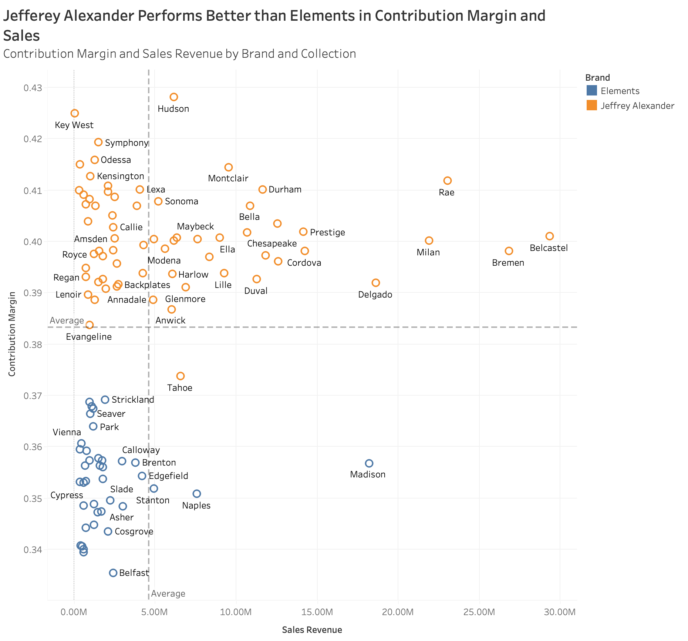
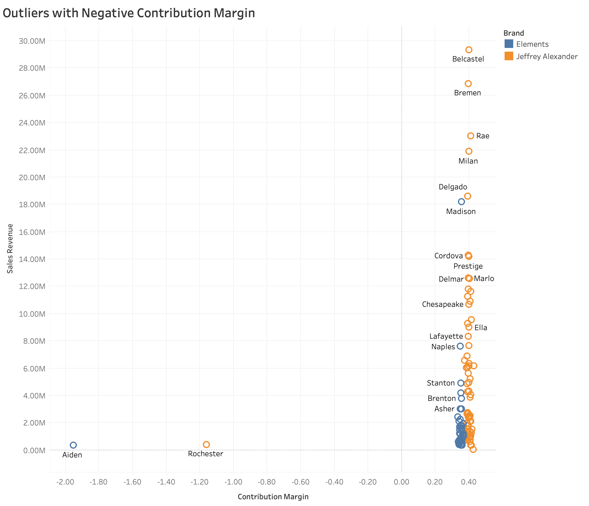
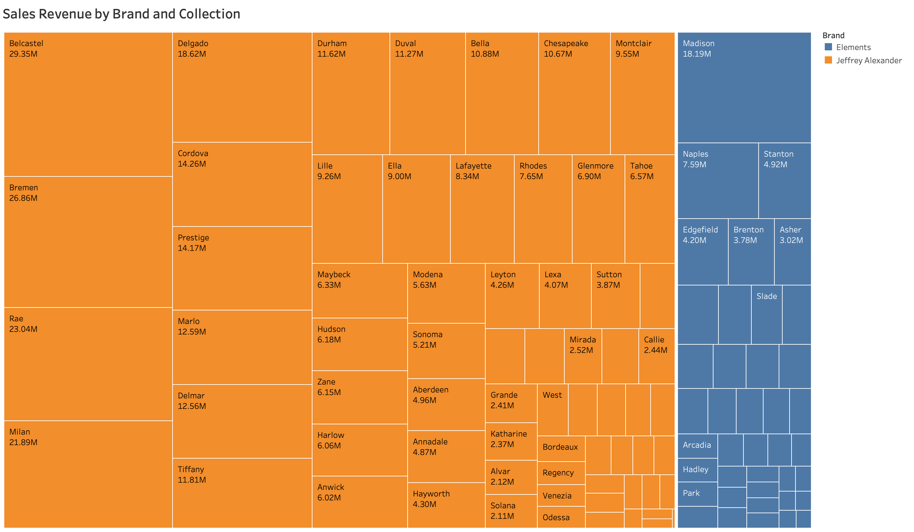
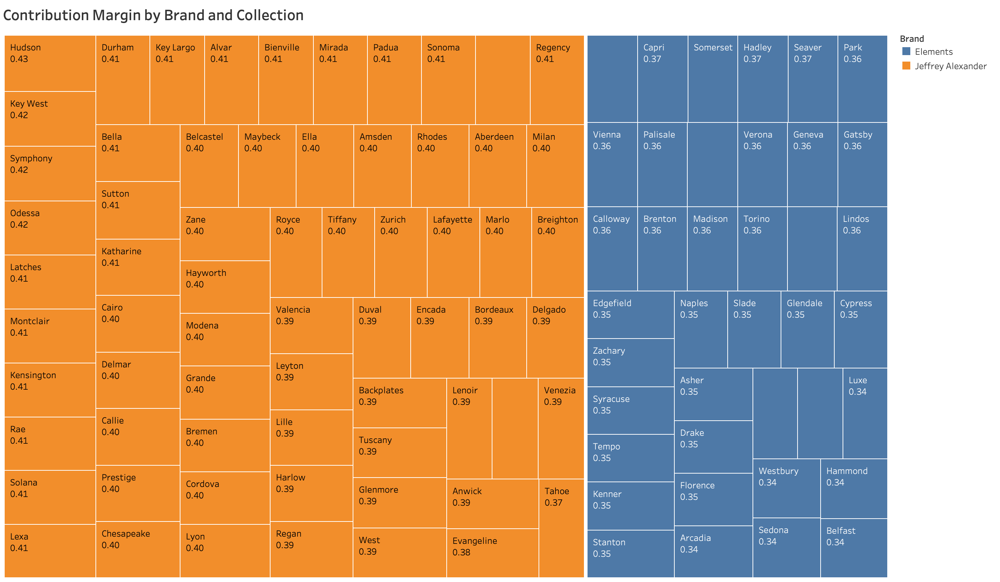

```{r}
library(tidyverse)
library(here)
library(janitor)
library(lubridate)
library(patchwork)

```

# Load data

```{r}
# import data
overheads <- readxl::read_excel(here("Data","Overheads.xlsx"))
transactions <- read.delim(here("Data","Transactions.txt"))
```

# Data Cleaning

```{r}
unique(transactions$region)
```

```{r}
transactions[transactions$region == "Centrall", "region"] <-"Central"
transactions[transactions$region == "Soouth", "region"] <-"South"
```

```{r}
# clean data
transactions$quantity_sold<- as.numeric(transactions$quantity_sold)
transactions$date_of_sale<-lubridate::as_date(transactions$date_of_sale, format = '%d/%m/%Y') 
transactions <- transactions %>% 
  mutate(across(c(list_price,cost), ~gsub("\\$", "", .) %>% as.numeric))
head(transactions)

overheads<-rename(overheads, category = `For the year 2018`)
```

## Question 1

```{r}
# calculate overhead costs in 2018
overheads %>%  pivot_longer(2:9,names_to = "region", values_to = "overheads") %>% 
  pivot_wider(names_from = "category", values_from = "overheads") %>% #separate production and non-production costs in different columns
  clean_names() %>% 
  summarise(production_overheads = sum(production_overheads), 
            non_production_overheads = sum(non_production_overheads))  #summing up
# calculate sales revenue and costs
transactions <-transactions %>% 
  mutate(sales_revenue = list_price*quantity_sold, 
         costs = cost*quantity_sold,
         year = year(date_of_sale))

# calculate operating profits and percentage in sales
transactions %>% filter(year == 2018) %>% 
  summarise(sales_revenue = sum(sales_revenue), 
            costs = sum(costs)) %>% 
  mutate(gross_profits = sales_revenue-costs-48205754) %>% 
  mutate(operating_profit = gross_profits-9580000) %>% # subtract non-production overhead costs
  mutate(profit_as_percentage_of_sales = operating_profit/sales_revenue)
```

## Question 2

By calculating and plotting the operating profits of each region, we found that the Eastcoast region has the highest operating profits, as shown by the bar chart in figure 1. The West and South regions are suffering negative operating profits. By looking at figure 2, we see that the West region has a positive gross profits, which suggests that its non-production overheads must be higher than gross profits so that it brings the operating profits to a negative number.

By breaking down the costs, we can see that the non-production overhead costs are relatively low when compared with the other cost categories, as shown by figure 2. The largest of costs still come from product direct and variable costs, followed by production overheads.

```{r}

# calculate overhead costs in 2018
overheads_by_region <- overheads %>% 
  pivot_longer(2:9,names_to = "region", values_to = "overheads") %>% 
  pivot_wider(names_from = "category", values_from = "overheads") %>% #separate production and non-production costs in different columns
  clean_names()
overheads_by_region

transactions_by_region <- transactions %>% 
  filter(year == 2018) %>% 
  group_by(region) %>% 
  summarise(sales_revenue = sum(sales_revenue), 
            costs = sum(costs))
transactions_by_region

joined_by_region <- full_join(overheads_by_region, transactions_by_region, by = "region")
joined_by_region <- joined_by_region %>% 
  mutate(gross_profits = sales_revenue-costs-production_overheads) %>% 
  mutate(operating_profits = sales_revenue-costs-production_overheads-non_production_overheads)
head(joined_by_region)
```

### Figure 1- Operating Profits by Region

```{r}

(joined_by_region %>% 
  ggplot(aes(x = fct_reorder(region, -operating_profits), y = operating_profits)) +
  geom_col(fill = "darkred") +
  labs(x = "", y = "Absolute Operating Profits") +
  theme_minimal()) / (joined_by_region %>% 
  ggplot(aes(x = fct_reorder(region, -operating_profits), y = operating_profits/sales_revenue)) +
  geom_col(fill = "darkblue") +
  scale_y_continuous(labels = scales::percent) +
  labs(x = "", y = "% Operating Profits") +
  theme_minimal())

```

### Figure 2- Gross Profits by Region

```{r}

(joined_by_region %>% 
  ggplot(aes(x = fct_reorder(region, -gross_profits), y = gross_profits)) +
  geom_col(fill = "darkred") +
  labs(x = "", y = "Absolute Gross Profits") +
  theme_minimal()) / (joined_by_region %>% 
  ggplot(aes(x = fct_reorder(region, -gross_profits), y = gross_profits/sales_revenue)) +
  geom_col(fill = "darkblue") +
  scale_y_continuous(labels = scales::percent) +
  labs(x = "", y = "% Gross Profits") +
  theme_minimal())

```

```{r}

# joined_by_region %>% pivot_longer(c(2,3,5), names_to = "components", values_to = "value") %>%  ggplot(aes(x = fct_rev(fct_reorder(region, operating_profits)), y = operating_profits)) +
#   geom_col() +
#   labs(x = "Region", y = "Operating Profits")
#   theme_minimal()
# df<-joined_by_region %>% filter(region == "South")
# 
# 
# levels <- df$Category
# data1 <- df  %>%
#     mutate(Category = factor(Category, levels = levels),
#         ymin = round(cumsum(Value), 3),
#         ymax = lag(cumsum(Value), default = 0),
#         xmin = c(head(Category, -1), NA),
#         xmax = c(tail(Category, -1), NA),
#         Impact = ifelse(Category %in% c(as.character(df$Category[1]), as.character(df$Category[nrow(df)])),"Budget",
#                         ifelse(Value > 0, "Increase", "Decrease")
#            ))

# library(plotly)
# 
# x= list("Sales Revenue", "Variable Costs", "Production Overheads", "Gross Profits", "Non-Production Overheads", "Operating Profits")
# measure= c("relative", "relative", "relative", "total", "relative", "total")
# text= c("+60", "+80", "", "-40", "-20", "Total")
# y= c(60, 80, 0, -40, -20, 0)
# data = data.frame(x=factor(x,levels=x),measure,text,y)
# 
# fig <- plot_ly(
#   data, name = "20", type = "waterfall", measure = ~measure,
#   x = ~x, textposition = "outside", y= ~y, text =~text,
#   connector = list(line = list(color= "rgb(63, 63, 63)")))
# fig <- fig %>%
#   layout(title = "Profit and loss statement 2018",
#         xaxis = list(title = ""),
#         yaxis = list(title = ""),
#         autosize = TRUE,
#         showlegend = TRUE)
# 
# fig

```

### Figure 3- Cost Breakdown by Region

```{r}

joined_by_region %>% pivot_longer(c(2,3,5), names_to = "components", values_to = "value") %>% 
ggplot(aes(x = fct_rev(fct_reorder(region, sales_revenue)), y = value, fill = components)) +
  geom_bar(stat = "identity") +
  labs(x = "Region", y = "Components")
  theme_minimal()

```

### Figure 4- Cost Breakdown in Percentage by Region

```{r}
joined_by_region %>% pivot_longer(c(2,3,5), names_to = "components", values_to = "value") %>% 
ggplot(aes(x = fct_rev(fct_reorder(region, sales_revenue)), y = value, fill = components)) +
  geom_bar(stat = "identity", position = "fill") +
  labs(x = "Region", y = "Components") +
  theme_minimal()


```

## Question 3

As shown in figure 1 and 2, both sales revenue and contribution margin are higher for Jefferey Alexander brand. The difference in sales revenue is very large, which means that Jefferey Alexander is much more competitive in market than Elements. From figure 3, we see that for different collections, there is only a little variation in contribution margin (less than 10%) although the general trend shows the ones that generate higher revenues would give higher contribution margin for sales revenue under 10 million dollars.

From figure 4, we see that Belcastel contributed the most sales revenue to the Jefferey Alexander brand, while Madison contributed the most to the Elements brand.

```{r}
joined_by_region <- joined_by_region %>% 
  mutate(pro_overhead_per_sales = production_overheads/sales_revenue)

transactions_by_brand <- transactions %>% 
  left_join(joined_by_region %>% select(region, pro_overhead_per_sales), by = "region") %>% 
  mutate(production_overheads = pro_overhead_per_sales*sales_revenue,
         total_variable_cost = production_overheads+costs) %>% 
  group_by(brand) %>%
  summarize(sales_revenue = sum(sales_revenue), 
            total_variable_cost = sum(total_variable_cost)) %>% 
  mutate(contribution_margin = 1- (total_variable_cost/sales_revenue))
transactions_by_brand


# # contribution margin
# transactions_by_brand <- transactions %>% 
#   group_by(brand) %>%
#   summarize(costs = sum(costs), sales_revenue = sum(sales_revenue)) %>% 
#   mutate(contribution_margin = 1-costs/sales_revenue)
# transactions_by_brand
# 
# transactions_by_collection <- transactions %>% 
#   group_by(collection) %>%
#   summarize(costs = sum(costs), sales_revenue = sum(sales_revenue)) %>% 
#   mutate(contribution_margin = 1-costs/sales_revenue) %>% 
#   arrange(desc(contribution_margin))
# head(transactions_by_collection)
# 
# transactions_by_brand_collection <- transactions %>% 
#   group_by(brand, collection) %>%
#   summarize(costs = sum(costs), sales_revenue = sum(sales_revenue)) %>% 
#   mutate(contribution_margin = 1-costs/sales_revenue) %>% 
#   arrange(desc(contribution_margin))
```

### Figure 1

```{r}
transactions_by_brand %>% ggplot(aes(x = contribution_margin, y = brand)) + 
  geom_col() +
  geom_text(aes(label = round(contribution_margin, 2)))
```

### Figure 2

```{r}

transactions_by_brand %>% ggplot(aes(x = sales_revenue, y = brand)) + 
  geom_col() +
  geom_text(aes(label = round(sales_revenue)))

```

```{r}
# head(transactions_by_collection) %>% ggplot(aes(x = contribution_margin, y = fct_reorder(collection, contribution_margin))) + 
#   geom_col() +
#   geom_text(aes(label = round(contribution_margin, 2)))
```

### Figure 3





```{r}

# transactions_by_collection %>% ggplot(aes(x = sales_revenue, y = contribution_margin)) +
#   geom_point()

transactions_by_collection %>% filter(contribution_margin > 0) %>% ggplot(aes(x = sales_revenue, y = contribution_margin)) +
  geom_point() +
  geom_smooth()

transactions_by_brand_collection %>% filter(contribution_margin > 0) %>% ggplot(aes(x = sales_revenue, y = contribution_margin)) +
  geom_point() +
  geom_smooth() +
  facet_wrap(~brand)

```

### Figure 4




