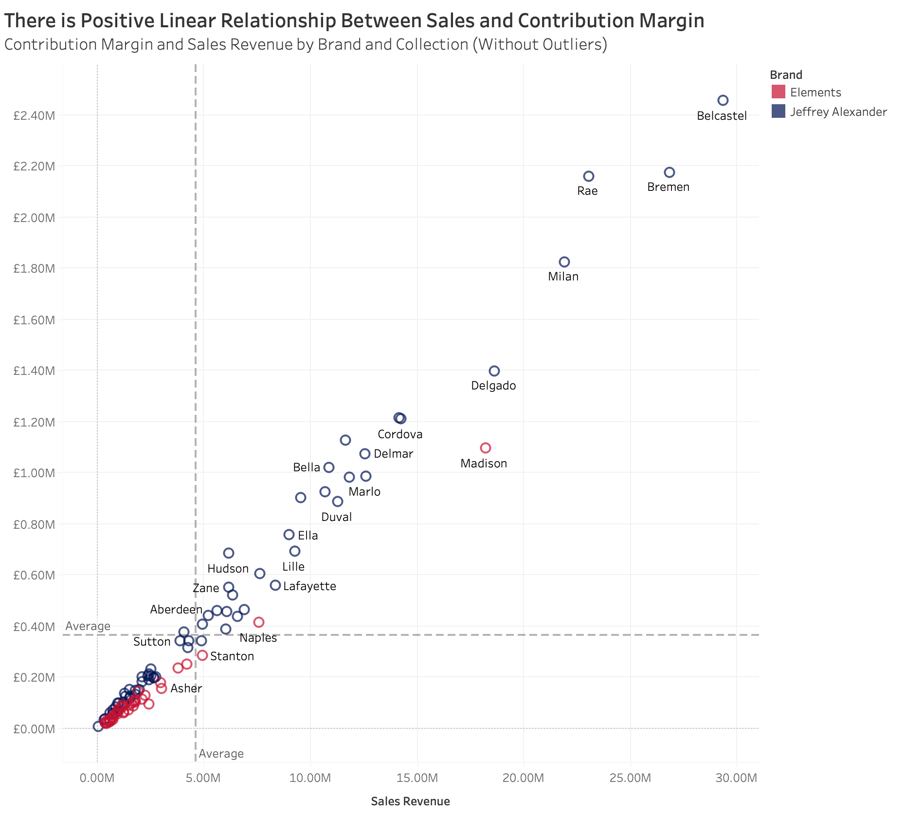

```{r message=FALSE, warning=FALSE}
library(tidyverse)
library(here)
library(janitor)
library(lubridate)
library(patchwork)

```

# Load data

```{r message=FALSE, warning=FALSE}
# import data
overheads <- readxl::read_excel(here("Data","Overheads.xlsx"))
transactions <- read.delim(here("Data","Transactions.txt"))
```

# Data Cleaning

```{r}
unique(transactions$region)
```

```{r}
transactions[transactions$region == "Centrall", "region"] <-"Central"
transactions[transactions$region == "Soouth", "region"] <-"South"
```

```{r}
# clean data
transactions$quantity_sold<- as.numeric(transactions$quantity_sold)
transactions$date_of_sale<-lubridate::as_date(transactions$date_of_sale, format = '%d/%m/%Y') 
transactions <- transactions %>% 
  mutate(across(c(list_price,cost), ~gsub("\\$", "", .) %>% as.numeric))
head(transactions)

overheads<-rename(overheads, category = `For the year 2018`)
```

# Question 1

```{r}
# calculate overhead costs in 2018
overheads %>%  pivot_longer(2:9,names_to = "region", values_to = "overheads") %>% 
  pivot_wider(names_from = "category", values_from = "overheads") %>% #separate production and non-production costs in different columns
  clean_names() %>% 
  summarise(production_overheads = sum(production_overheads), 
            non_production_overheads = sum(non_production_overheads))  #summing up
# calculate sales revenue and costs
transactions <-transactions %>% 
  mutate(sales_revenue = list_price*quantity_sold, 
         costs = cost*quantity_sold,
         year = year(date_of_sale))

# calculate operating profits and percentage in sales
transactions %>% filter(year == 2018) %>% 
  summarise(sales_revenue = sum(sales_revenue), 
            costs = sum(costs)) %>% 
  mutate(gross_profits = sales_revenue-costs-48205754) %>% 
  mutate(operating_profit = gross_profits-9580000) %>% # subtract non-production overhead costs
  mutate(profit_as_percentage_of_sales = operating_profit/sales_revenue)
```

# Question 2

By calculating and plotting the operating profits of each region, we found that the Eastcoast region has the highest operating profits, as shown by the bar chart in figure 1. The West and South regions are suffering negative operating profits. By looking at figure 2, we see that the West region has a positive gross profits, which suggests that its non-production overheads must be higher than gross profits so that it brings the operating profits to a negative number.

By breaking down the costs, we can see that the non-production overhead costs are relatively low when compared with the other cost categories, as shown by figure 2. The largest of costs still come from product direct and variable costs, followed by production overheads.

```{r}

# calculate overhead costs in 2018
overheads_by_region <- overheads %>% 
  pivot_longer(2:9,names_to = "region", values_to = "overheads") %>% 
  pivot_wider(names_from = "category", values_from = "overheads") %>% #separate production and non-production costs in different columns
  clean_names()
overheads_by_region

transactions_by_region <- transactions %>% 
  filter(year == 2018) %>% 
  group_by(region) %>% 
  summarise(sales_revenue = sum(sales_revenue), 
            costs = sum(costs))
transactions_by_region

joined_by_region <- full_join(overheads_by_region, transactions_by_region, by = "region")
joined_by_region <- joined_by_region %>% 
  mutate(gross_profits = sales_revenue-costs-production_overheads) %>% 
  mutate(operating_profits = sales_revenue-costs-production_overheads-non_production_overheads)
head(joined_by_region)
```

## Figure 1- Operating Profits by Region

```{r}

(joined_by_region %>% 
  ggplot(aes(x = fct_reorder(region, -operating_profits), y = operating_profits)) +
  geom_col(fill = "darkred") +
  labs(x = "", y = "Absolute Operating Profits") +
  theme_minimal()) / (joined_by_region %>% 
  ggplot(aes(x = fct_reorder(region, -operating_profits), y = operating_profits/sales_revenue)) +
  geom_col(fill = "darkblue") +
  scale_y_continuous(labels = scales::percent) +
  labs(x = "", y = "% Operating Profits") +
  theme_minimal())

```

## Figure 2- Gross Profits by Region

```{r}

(joined_by_region %>% 
  ggplot(aes(x = fct_reorder(region, -gross_profits), y = gross_profits)) +
  geom_col(fill = "darkred") +
  labs(x = "", y = "Absolute Gross Profits") +
  theme_minimal()) / (joined_by_region %>% 
  ggplot(aes(x = fct_reorder(region, -gross_profits), y = gross_profits/sales_revenue)) +
  geom_col(fill = "darkblue") +
  scale_y_continuous(labels = scales::percent) +
  labs(x = "", y = "% Gross Profits") +
  theme_minimal())

```

## Figure 3- Cost Breakdown by Region

```{r}

joined_by_region %>% pivot_longer(c(2,3,5), names_to = "components", values_to = "value") %>% 
ggplot(aes(x = fct_rev(fct_reorder(region, sales_revenue)), y = value, fill = components)) +
  geom_bar(stat = "identity") +
  labs(x = "Region", y = "Components")+
  theme_minimal() +
  scale_fill_brewer(palette = "Blues")

```

## Figure 4- Cost Breakdown in Percentage by Region

```{r}
joined_by_region %>% pivot_longer(c(2,3,5), names_to = "components", values_to = "value") %>% 
ggplot(aes(x = fct_rev(fct_reorder(region, sales_revenue)), y = value, fill = components)) +
  geom_bar(stat = "identity", position = "fill") +
  labs(x = "Region", y = "Components") +
  theme_minimal() +
  scale_fill_brewer(palette = "Blues")


```

# Question 3

As shown in figure 1 and 2, both sales revenue and contribution margin are higher for Jefferey Alexander brand. The difference in sales revenue is very large, which means that Jefferey Alexander is much more competitive in market than Elements. From figure 3, we see that for different collections, there is a positive relationship between sales revenue and contribution margin, which holds true for both brands.

From figure 4, we see that Belcastel contributed the most sales revenue and contribution margin to the Jefferey Alexander brand, while Madison contributed the most to the Elements brand.

```{r}
joined_by_region <- joined_by_region %>% 
  mutate(pro_overhead_per_sales = production_overheads/sales_revenue)

transactions_by_brand <- transactions %>% 
  left_join(joined_by_region %>% select(region, pro_overhead_per_sales), by = "region") %>% 
  mutate(production_overheads = pro_overhead_per_sales*sales_revenue,
         total_variable_cost = production_overheads+costs) %>% 
  group_by(brand) %>%
  summarize(sales_revenue = sum(sales_revenue), 
            total_variable_cost = sum(total_variable_cost)) %>% 
  mutate(contribution_margin_perc = 1- (total_variable_cost/sales_revenue),
         contribution_margin = sales_revenue-total_variable_cost)
transactions_by_brand

transactions_by_collection <- transactions %>% 
  left_join(joined_by_region %>% select(region, pro_overhead_per_sales), by = "region") %>% 
  mutate(production_overheads = pro_overhead_per_sales*sales_revenue,
         total_variable_cost = production_overheads+costs) %>% 
  group_by(collection) %>%
  summarize(sales_revenue = sum(sales_revenue), 
            total_variable_cost = sum(total_variable_cost)) %>% 
  mutate(contribution_margin_perc = 1- (total_variable_cost/sales_revenue),
         contribution_margin = sales_revenue-total_variable_cost)
head(transactions_by_collection)

transactions_by_brand_collection <- transactions %>% 
  left_join(joined_by_region %>% select(region, pro_overhead_per_sales), by = "region") %>% 
  mutate(production_overheads = pro_overhead_per_sales*sales_revenue,
         total_variable_cost = production_overheads+costs) %>% 
  group_by(brand,collection) %>%
  summarize(sales_revenue = sum(sales_revenue), 
            total_variable_cost = sum(total_variable_cost)) %>% 
  mutate(contribution_margin_perc = 1- (total_variable_cost/sales_revenue),
         contribution_margin = sales_revenue-total_variable_cost)
head(transactions_by_brand_collection)
```

## Figure 1

```{r}
transactions_by_brand %>% ggplot(aes(x = contribution_margin/1000000, y = brand, fill = brand)) + 
  geom_col() +
  geom_text(aes(label = round(contribution_margin/1000000)),  hjust = 1.5, color = '#ffffff') +
  scale_fill_manual(values = c("darkred", "darkblue"))+
  labs(x = "Contribution Margin (Millions $)", y = "Brand") +
  theme_minimal()
```

## Figure 2

```{r}

transactions_by_brand %>% ggplot(aes(x = sales_revenue/1000000, y = brand, fill = brand)) + 
  geom_col() +
  geom_text(aes(label = round(sales_revenue/1000000)), hjust = 1.5, color = '#ffffff') +
  scale_fill_manual(values = c("darkred", "darkblue"))+
  labs(x = "Sales Revenue (Million $)", y = "Brand") +
  theme_minimal()

```

## Figure 3





```{r}

# transactions_by_collection %>% ggplot(aes(x = sales_revenue, y = contribution_margin)) +
#   geom_point()

transactions_by_brand_collection %>% filter(contribution_margin > 0) %>% ggplot(aes(x = sales_revenue, y = contribution_margin)) +
  geom_point() +
  geom_smooth(se = FALSE)+
  scale_fill_manual(values = c("darkred", "darkblue"))+
  labs(x = "Sales Revenue ($)", y = "Contribution Margin") +
  theme_minimal()

transactions_by_brand_collection %>% filter(contribution_margin > 0) %>% ggplot(aes(x = sales_revenue, y = contribution_margin)) +
  geom_point() +
  geom_smooth(se = FALSE) +
  facet_wrap(~brand)+
  labs(x = "Sales Revenue ($)", y = "Contribution Margin") +
  theme_minimal()

```

## Figure 4


## Figure 5


# Question 4

We choose to find the breakeven sales and volume by chronological order of transactions.

## Overall

```{r}
transactions_variableCost <- transactions %>% 
  filter(year == 2018) %>% 
  arrange(date_of_sale) %>% 
  left_join(joined_by_region %>% select(region, pro_overhead_per_sales), by = "region") %>% 
  mutate(total_variable_cost = costs + pro_overhead_per_sales*sales_revenue)

break_even <- data.frame(total_cost = cumsum(transactions_variableCost$total_variable_cost) + sum(joined_by_region$non_production_overheads),
                         sales_revenue = cumsum(transactions_variableCost$sales_revenue),
                         volume = cumsum(transactions_variableCost$quantity_sold),
                         date = transactions_variableCost$date_of_sale)

break_even[which(break_even$total_cost <= break_even$sales_revenue)[1],]
```

Overall, the company manage to breakeven at 2018-10-21 with a breakeven sales revenue of 122.79 million and a breakeven sales volume of 6.75 million.

```{r}
ggplot(break_even, aes(x = volume)) +
  geom_line(aes(y = total_cost, color = "Cost")) +
  geom_line(aes(y = sales_revenue, color = "Revenue")) +
  annotate("text", 
           x = break_even[which(break_even$total_cost <= break_even$sales_revenue)[1],][3] %>% pull() - 2000000,
           y = break_even[which(break_even$total_cost <= break_even$sales_revenue)[1],][2] %>% pull(),
           label = "Break-Even Point",
           size = 4,
           color = "darkgreen") +
  annotate("segment", 
           x = break_even[which(break_even$total_cost <= break_even$sales_revenue)[1],][3] %>% pull() - 800000,
           xend = break_even[which(break_even$total_cost <= break_even$sales_revenue)[1],][3] %>% pull() - 100000,
           y = break_even[which(break_even$total_cost <= break_even$sales_revenue)[1],][2] %>% pull(),
           yend = break_even[which(break_even$total_cost <= break_even$sales_revenue)[1],][2] %>% pull(),
           arrow = arrow(),
           size = 0.5,
           color = "darkgreen") +
  scale_colour_manual("", 
                      breaks = c("Cost", "Revenue"),
                      values = c("darkred", "darkblue")) +
  theme_minimal() +
  labs(title = "Cumulative Sales Volume with Revenue/Cost showing Breakeven",
       x = "Sales Volume",
       y = "Revenue/Cost")
```


## Regional

```{r}
unique(transactions_variableCost$region)
```

```{r}
transactions_variableCost_Northeast <- transactions_variableCost %>% filter(region == "Northeast")
break_even_Northeast <- data.frame(total_cost = cumsum(transactions_variableCost_Northeast$total_variable_cost) + (overheads[2,"Northeast"] %>% pull()),
                         sales_revenue = cumsum(transactions_variableCost_Northeast$sales_revenue),
                         volume = cumsum(transactions_variableCost_Northeast$quantity_sold),
                         date = transactions_variableCost_Northeast$date_of_sale)

transactions_variableCost_Eastcoast <- transactions_variableCost %>% filter(region == "East coast")
break_even_Eastcoast <- data.frame(total_cost = cumsum(transactions_variableCost_Eastcoast$total_variable_cost) + (overheads[2,"East coast"] %>% pull()),
                         sales_revenue = cumsum(transactions_variableCost_Eastcoast$sales_revenue),
                         volume = cumsum(transactions_variableCost_Eastcoast$quantity_sold),
                         date = transactions_variableCost_Eastcoast$date_of_sale)

transactions_variableCost_Midwest <- transactions_variableCost %>% filter(region == "Midwest")
break_even_Midwest <- data.frame(total_cost = cumsum(transactions_variableCost_Midwest$total_variable_cost) + (overheads[2,"Midwest"] %>% pull()),
                         sales_revenue = cumsum(transactions_variableCost_Midwest$sales_revenue),
                         volume = cumsum(transactions_variableCost_Midwest$quantity_sold),
                         date = transactions_variableCost_Midwest$date_of_sale)

transactions_variableCost_Central <- transactions_variableCost %>% filter(region == "Central")
break_even_Central <- data.frame(total_cost = cumsum(transactions_variableCost_Central$total_variable_cost) + (overheads[2,"Central"] %>% pull()),
                         sales_revenue = cumsum(transactions_variableCost_Central$sales_revenue),
                         volume = cumsum(transactions_variableCost_Central$quantity_sold),
                         date = transactions_variableCost_Central$date_of_sale)

transactions_variableCost_West <- transactions_variableCost %>% filter(region == "West")
break_even_West <- data.frame(total_cost = cumsum(transactions_variableCost_West$total_variable_cost) + (overheads[2,"West"] %>% pull()),
                         sales_revenue = cumsum(transactions_variableCost_West$sales_revenue),
                         volume = cumsum(transactions_variableCost_West$quantity_sold),
                         date = transactions_variableCost_West$date_of_sale)

transactions_variableCost_South <- transactions_variableCost %>% filter(region == "South")
break_even_South <- data.frame(total_cost = cumsum(transactions_variableCost_South$total_variable_cost) + (overheads[2,"South"] %>% pull()),
                         sales_revenue = cumsum(transactions_variableCost_South$sales_revenue),
                         volume = cumsum(transactions_variableCost_South$quantity_sold),
                         date = transactions_variableCost_South$date_of_sale)

transactions_variableCost_Northwest <- transactions_variableCost %>% filter(region == "Northwest")
break_even_Northwest <- data.frame(total_cost = cumsum(transactions_variableCost_Northwest$total_variable_cost) + (overheads[2,"Northwest"] %>% pull()),
                         sales_revenue = cumsum(transactions_variableCost_Northwest$sales_revenue),
                         volume = cumsum(transactions_variableCost_Northwest$quantity_sold),
                         date = transactions_variableCost_Northwest$date_of_sale)

transactions_variableCost_International <- transactions_variableCost %>% filter(region == "International")
break_even_International <- data.frame(total_cost = cumsum(transactions_variableCost_International$total_variable_cost) + (overheads[2,"International"] %>% pull()),
                         sales_revenue = cumsum(transactions_variableCost_International$sales_revenue),
                         volume = cumsum(transactions_variableCost_International$quantity_sold),
                         date = transactions_variableCost_International$date_of_sale)

break_even_region <- data.frame(
  region = unique(transactions_variableCost$region),
  break_even_date = c(break_even_Northeast[which(break_even_Northeast$total_cost <= break_even_Northeast$sales_revenue)[1],][4] %>% pull(),
                      break_even_Eastcoast[which(break_even_Eastcoast$total_cost <= break_even_Eastcoast$sales_revenue)[1],][4] %>% pull(),
                      break_even_Midwest[which(break_even_Midwest$total_cost <= break_even_Midwest$sales_revenue)[1],][4] %>% pull(),
                      break_even_Central[which(break_even_Central$total_cost <= break_even_Central$sales_revenue)[1],][4] %>% pull(),
                      break_even_West[which(break_even_West$total_cost <= break_even_West$sales_revenue)[1],][4] %>% pull(),
                      break_even_South[which(break_even_South$total_cost <= break_even_South$sales_revenue)[1],][4] %>% pull(),
                      break_even_Northwest[which(break_even_Northwest$total_cost <= break_even_Northwest$sales_revenue)[1],][4] %>% pull(),
                      break_even_International[which(break_even_International$total_cost <= break_even_International$sales_revenue)[1],][4] %>% pull()),
  break_even_sales = c(break_even_Northeast[which(break_even_Northeast$total_cost <= break_even_Northeast$sales_revenue)[1],][2] %>% pull(),
                       break_even_Eastcoast[which(break_even_Eastcoast$total_cost <= break_even_Eastcoast$sales_revenue)[1],][2] %>% pull(),
                       break_even_Midwest[which(break_even_Midwest$total_cost <= break_even_Midwest$sales_revenue)[1],][2] %>% pull(),
                       break_even_Central[which(break_even_Central$total_cost <= break_even_Central$sales_revenue)[1],][2] %>% pull(),
                       break_even_West[which(break_even_West$total_cost <= break_even_West$sales_revenue)[1],][2] %>% pull(),
                       break_even_South[which(break_even_South$total_cost <= break_even_South$sales_revenue)[1],][2] %>% pull(),
                       break_even_Northwest[which(break_even_Northwest$total_cost <= break_even_Northwest$sales_revenue)[1],][2] %>% pull(),
                       break_even_International[which(break_even_International$total_cost <= break_even_International$sales_revenue)[1],][2] %>% pull()),
  break_even_quantity = c(break_even_Northeast[which(break_even_Northeast$total_cost <= break_even_Northeast$sales_revenue)[1],][3] %>% pull(),
                          break_even_Eastcoast[which(break_even_Eastcoast$total_cost <= break_even_Eastcoast$sales_revenue)[1],][3] %>% pull(),
                          break_even_Midwest[which(break_even_Midwest$total_cost <= break_even_Midwest$sales_revenue)[1],][3] %>% pull(),
                          break_even_Central[which(break_even_Central$total_cost <= break_even_Central$sales_revenue)[1],][3] %>% pull(),
                          break_even_West[which(break_even_West$total_cost <= break_even_West$sales_revenue)[1],][3] %>% pull(),
                          break_even_South[which(break_even_South$total_cost <= break_even_South$sales_revenue)[1],][3] %>% pull(),
                          break_even_Northwest[which(break_even_Northwest$total_cost <= break_even_Northwest$sales_revenue)[1],][3] %>% pull(),
                          break_even_International[which(break_even_International$total_cost <= break_even_International$sales_revenue)[1],][3] %>% pull())
  )
break_even_region 
```

As we can see, most regions break even in between August and September but only two regions "West" and "South" did not break even. The region "International" broke even very early in the year only at April.

```{r fig.width=10, fig.height=10}
break_even_Northeast %>% 
  mutate(region = "Northeast") %>% 
  rbind(break_even_Eastcoast %>% mutate(region = "Eastcoast")) %>% 
  rbind(break_even_Midwest %>% mutate(region = "Midwest")) %>% 
  rbind(break_even_Central %>% mutate(region = "Central")) %>% 
  rbind(break_even_West %>% mutate(region = "West")) %>% 
  rbind(break_even_South %>% mutate(region = "South")) %>% 
  rbind(break_even_Northwest %>% mutate(region = "Northwest")) %>% 
  rbind(break_even_International %>% mutate(region = "International")) %>% 
  select(-date) %>% 
  ggplot(aes(x = volume)) +
    geom_line(aes(y = total_cost, color = "Cost")) +
    geom_line(aes(y = sales_revenue, color = "Revenue")) +
    scale_colour_manual("", 
                        breaks = c("Cost", "Revenue"),
                        values = c("darkred", "darkblue")) +
    facet_wrap(~region, scales = "free") +
    theme_minimal() +
    labs(title = "Cumulative Sales Volume with Revenue/Cost showing Breakeven",
         x = "Sales Volume",
         y = "Revenue/Cost")
```

# Question 5

## a)

Cost absorption is an approach of allocating fixed overhead costs to each unit of a product produced in the same period when the fixed overhead cost is made. This disregards when the produced good is actually sold.

With the data provided, we only know when products are sold but has no information on when it is produced. However, we can make an assumption that the company uses made to order policy and hence the sales is made when the product is produced. Similar to above, we will split the regional overhead costs by regional sales revenue of each transaction.

```{r}
joined_by_region <- joined_by_region %>% 
  mutate(overhead_per_sales = (production_overheads+non_production_overheads)/sales_revenue)

transactions_by_brand_collection <- transactions %>% 
  filter(year == 2018) %>% 
  left_join(joined_by_region %>% select(region, overhead_per_sales), by = "region") %>% 
  mutate(overheads = overhead_per_sales*sales_revenue,
         total_cost = overheads+costs) %>% 
  group_by(brand,collection) %>%
  summarize(total_cost = sum(total_cost))
transactions_by_brand_collection
```

## b)

Our full cost estimations could be improved if we can know about when the products of each transactions are produced and hence allocate the fixed cost according to their production date instead of date of sales.

If detailed information about each products are hard to gather, mean inventory holding period of each product or turnover rate could also be used to make a rough estimate of when each product is produced.
